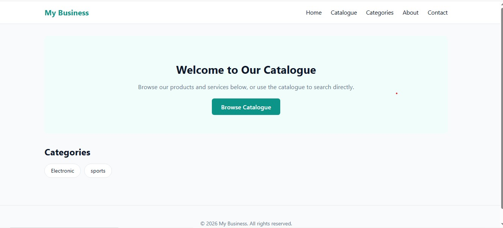
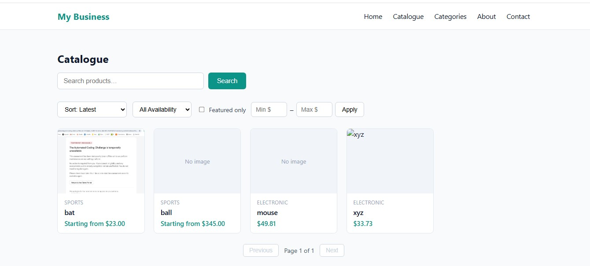
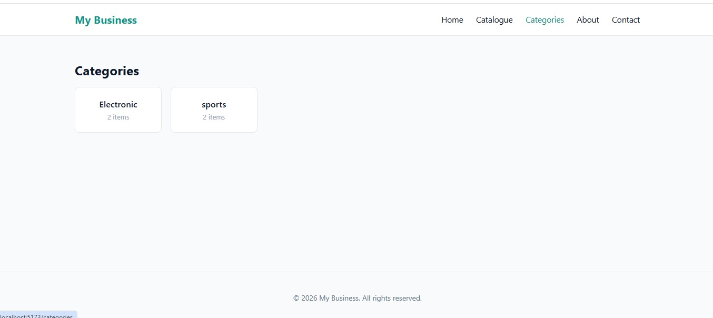
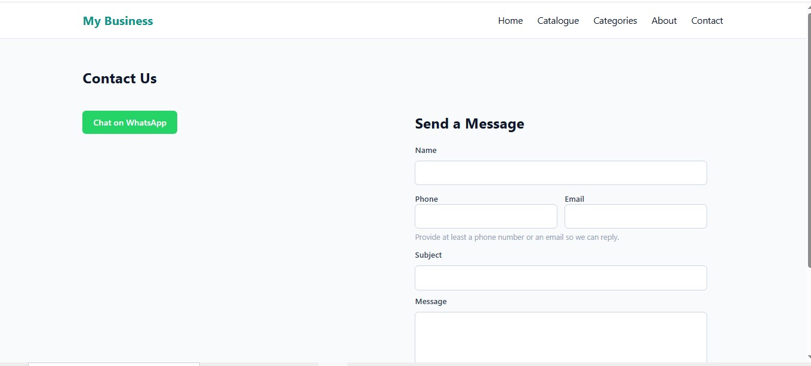
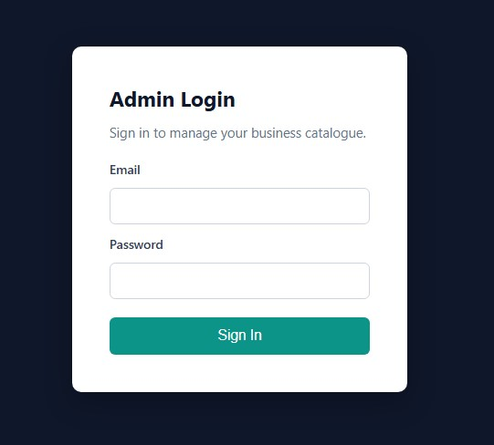
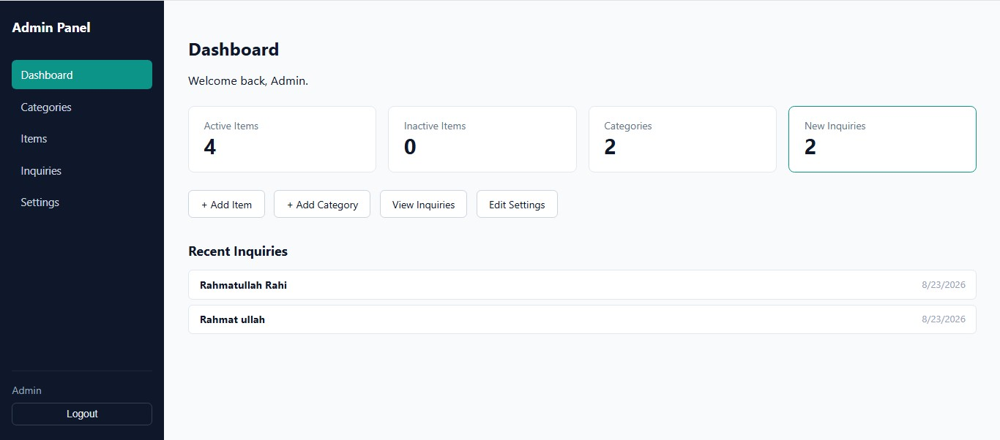
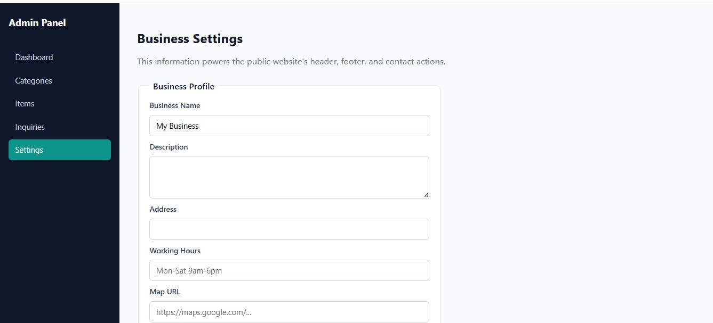
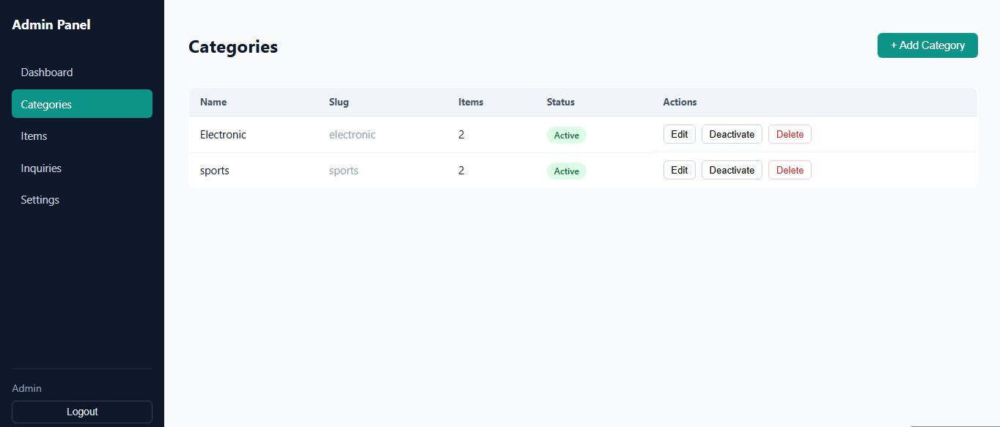
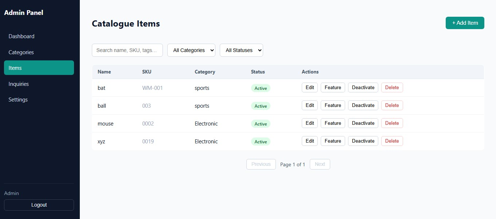

# Business Catalogue Platform

A reusable, configurable web platform that lets retail and service businesses publish a
professional product/service catalogue online — with a secure admin panel to manage everything,
no coding required after setup.

Built as a full-stack MVP: **React 18 · Node.js · Express · MongoDB · JWT Authentication**

---

## What This Is

Think of it as a lightweight, self-hosted alternative to a full e-commerce platform for
businesses that don't need online checkout — a tile shop, a furniture store, a service
provider — who just want customers to browse what they offer and get in touch. The business
owner manages everything (products, categories, contact info, branding) through a clean admin
dashboard; customers browse a fast, responsive public site and reach out via WhatsApp, phone,
email, or a contact form.

## Key Features

- 🗂️ **Category & product management** — full CRUD, image galleries, flexible pricing formats
  (fixed, range, "starting from," "contact for price")
- 🔍 **Public catalogue browsing** — search, category filtering, sorting, pagination
- 💬 **Customer inquiries** — general and item-specific contact forms, WhatsApp deep links, spam
  protection
- 🔐 **Secure admin panel** — JWT authentication stored in httpOnly cookies, bcrypt password
  hashing, protected routes
- 🎨 **Configurable branding** — business name, logo, colors, and contact info editable from the
  admin panel, no code changes needed
- 📱 **Fully responsive** — works cleanly on mobile, tablet, and desktop
- 🖼️ **Image upload with validation** — file type and size restrictions, primary image selection

## Screenshots

**Public Site**

| Home | Catalogue | Categories | Contact (WhatsApp) |
|---|---|---|---|
|  |  |  |  |

**Admin Panel**

| Login | Dashboard | Settings |
|---|---|---|
|  |  |  |

| Add Category | Add Item | Inquiries |
|---|---|---|
|  |  |  |

## Tech Stack

| Layer | Technology |
|---|---|
| Frontend | React 18, Vite, React Router |
| Backend | Node.js, Express |
| Database | MongoDB with Mongoose |
| Auth | JWT (httpOnly cookies), bcrypt |
| File Uploads | Multer |

## Project Status

This project is being built incrementally, one milestone at a time. Each milestone lives in its
own self-contained folder with its own setup instructions.

| Milestone | Focus | Status |
|---|---|---|
| [01 — Foundation & Auth](./01-foundation-and-auth) | Authentication, database schema, business settings, base layouts | ✅ Complete |
| [02 — Catalog Management](./02-catalog-management) | Category/item management, image uploads, public browsing, search & pagination | ✅ Complete |
| [03 — Customer Engagement](./03-customer-engagement) | Customer inquiries, WhatsApp integration, contact/about pages, filters/sorting, SEO basics | ✅ Complete |
| 04 — Quality & Deployment | Testing, security hardening, production deployment | 🔜 In Progress |

## Getting Started

Each milestone folder is self-contained with its own `client/` and `server/`. To run the most
recent version:

```bash
cd 03-customer-engagement/server
npm install
cp .env.example .env      # then fill in your own values
npm run seed:admin        # first time only — creates the initial admin login
npm run dev
```

```bash
cd 03-customer-engagement/client
npm install
cp .env.example .env
npm run dev
```

Full setup instructions, environment variables, and API documentation are in each milestone's
own README (e.g. [`03-customer-engagement/README.md`](./03-customer-engagement/README.md)).

## Roadmap

- [x] Authentication & admin foundation
- [x] Category and product catalogue management
- [x] Public browsing, search, and pagination
- [x] Customer inquiries & WhatsApp integration
- [x] Filters, sorting, and SEO basics
- [ ] Automated testing & production deployment
- [ ] Multi-language support *(future / post-MVP)*
- [ ] Analytics dashboard *(future / post-MVP)*

## License

This project is currently unlicensed while under active development. A license will be added
before any public release.
